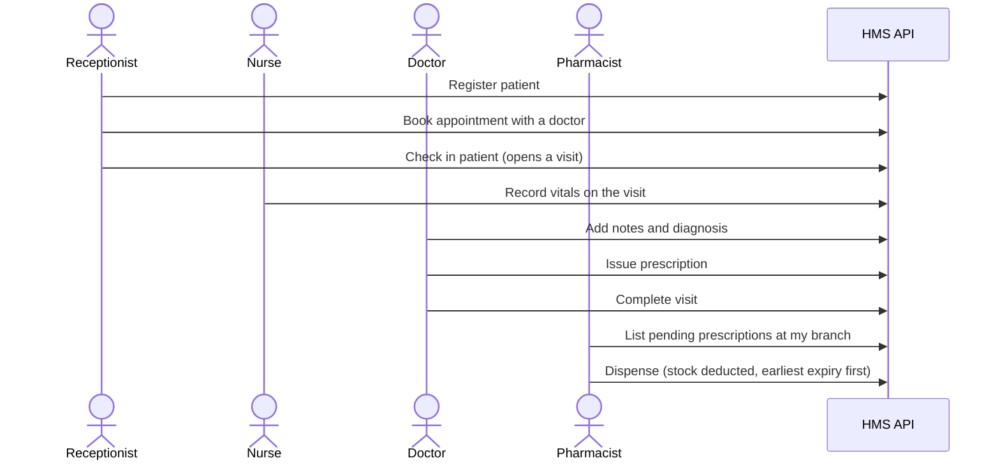

# Hospital Management System

[](https://github.com/MohamedElfares/hospital-management-system/actions/workflows/ci.yml)

A hospital system that connects registration, scheduling, consultations, a multi-branch
pharmacy, customer service and a patient portal, so that each person can do exactly what
their role requires and every access to medical data is traceable. A FastAPI backend with
PostgreSQL, and a React frontend from Phase 2, built in five phases.

The full specification — scope, rules, endpoints and decisions — is in
[`docs/PROJECT_PLAN.md`](docs/PROJECT_PLAN.md).

## Status

**Phase 1, Milestone 1.1 (Foundation).** The application runs, serves its health checks
and has tests, but it has no users, roles or clinical data yet: those arrive in the
milestones below.

| Milestone | What it adds | State |
|---|---|---|
| 1.1 Foundation | Settings, database layer, error format, request IDs, health checks, tests, CI | **Done** |
| 1.2 Identity and access | Users, login with cookie refresh, permissions, staff administration, first deployment | Next |
| 1.3 Organization, audit, patients | Departments, branches, staff profiles, audit log, patients | Planned |
| 1.4 Scheduling | Appointments, slots, check-in | Planned |
| 1.5 Clinical and prescriptions | Vitals, visits, prescriptions | Planned |
| 1.6 Pharmacy | Medicines, stock batches, FEFO dispensing, reports | Planned |
| 1.7 Release readiness | Workflow test, demo data, security checklist, ADRs | Planned |

Phases 2 to 5 add the staff web app, pharmacy branches, the patient portal, and customer
service and management (plan §2).

There is no public deployment yet; the first one happens in Milestone 1.2.

## What works today

| Endpoint | Purpose |
|---|---|
| `GET /health/live` | The process is running. Touches nothing else, so a sleeping database never makes it fail. |
| `GET /health/ready` | The application can serve requests: it runs `SELECT 1`. Answers `503` in the standard error format when the database is unreachable. |
| `GET /docs` | Interactive API documentation, generated from the code. |

Behind those three:

- **Validated settings.** A wrong database driver, a short JWT secret or an unknown
  timezone stops the application at startup instead of failing later.
- **One error format** for every failure, including the ones FastAPI and Starlette raise
  themselves: `{"error": {"code", "message", "details", "request_id"}}`.
- **A request ID** on every request, returned in the `X-Request-ID` header, included in
  error bodies, and written in one log line per request with the method, path, status and
  duration — so a failure a user reports can be found in the logs.
- **A database layer** that gives every future table a UUID primary key and timezone-aware
  UTC timestamps, with Alembic wired to the models.

## The workflow this is being built toward



None of these endpoints exist yet; they are built in Milestones 1.3 to 1.6.

## Architecture

A modular monolith: one FastAPI application, split into modules that each own their
tables and rules, deployed as a single container (plan §9).

| Layer | File | Responsibility |
|---|---|---|
| Router | `router.py` | HTTP only: validate input, call one service, declare the response model |
| Schemas | `schemas.py` | Pydantic request and response models |
| Service | `service.py` | Business rules, record-level authorization, state transitions, the transaction boundary |
| Repository | `repository.py` | Queries, and nothing else |
| Models | `models.py` | SQLAlchemy tables and constraints |

Cross-cutting infrastructure lives in `app/core/` (settings, errors, logging) and
`app/db/` (base model, session), and neither imports from the business modules.

The decisions behind this are recorded as ADRs in [`docs/adr/`](docs/adr/):
[0001 — a modular monolith instead of microservices](docs/adr/0001-modular-monolith.md)
and
[0002 — synchronous SQLAlchemy instead of async](docs/adr/0002-synchronous-sqlalchemy.md).

Three rules shape most of the design:

- **Deny by default.** Every route is Public, Authenticated, or protected by a permission,
  and record-level checks live in services. A record outside your scope returns `404`, not
  `403`, so IDs cannot be probed.
- **The database enforces what must survive concurrency:** partial unique indexes for
  double-booking, `CHECK` constraints for stock, and row locks for dispensing.
- **Services never raise `HTTPException`.** They raise domain errors, and handlers turn
  those into the one response format.

## Tech stack

| Concern | Choice |
|---|---|
| Language | Python 3.13 |
| Web framework | FastAPI 0.141 with Pydantic 2 |
| Database | PostgreSQL 17, SQLAlchemy 2 with psycopg 3 |
| Migrations | Alembic |
| Packaging | uv, with a committed lockfile |
| Lint and format | Ruff, also run by pre-commit |
| Tests | pytest with pytest-cov, against a real PostgreSQL database |
| CI | GitHub Actions |
| Planned | React 19 and TypeScript (Phase 2), Docker image and Render plus Neon hosting (Milestone 1.2) |

## Running it locally

**You need** [Docker](https://www.docker.com/), [uv](https://docs.astral.sh/uv/), and Git.

```bash
git clone https://github.com/MohamedElfares/hospital-management-system.git
cd hospital-management-system

# 1. Start PostgreSQL 17
docker compose up -d db

# 2. Create the database the tests use (once)
docker compose exec db createdb -U hms hms_test

# 3. Configure the backend
cd backend
cp .env.example .env
uv run python -c "import secrets; print(secrets.token_hex(32))"   # paste into JWT_SECRET_KEY

# 4. Install dependencies and run the API
uv sync
uv run fastapi dev app/main.py
```

Then open <http://localhost:8000/docs>.

`.env.example` lists every setting with a safe development value. Only `JWT_SECRET_KEY`
has to be replaced; the database URLs match the Compose file.

### Tests

```bash
cd backend
uv run pytest                 # 20 tests
uv run pytest --cov=app       # with coverage; CI requires at least 80%
```

Tests run against the `hms_test` database, inside a transaction that is rolled back after
every test, so they leave nothing behind and never touch development data.
[`backend/tests/README.md`](backend/tests/README.md) explains the fixtures.

### Checks that CI also runs

```bash
cd backend
uv run ruff check .           # lint, including docstring and import rules
uv run ruff format --check .  # formatting
uv run alembic upgrade head   # apply migrations
uv run alembic check          # fail if the models and migrations disagree
```

## Repository layout

```text
backend/
├── app/
│   ├── main.py            # create_app(): logging, error handlers, middleware, routers
│   ├── api/health.py      # liveness and readiness checks
│   ├── core/              # config.py, errors.py, logging.py
│   └── db/                # base.py (declarative base and mixins), session.py
├── migrations/            # Alembic
└── tests/                 # pytest suite and its fixtures
docs/PROJECT_PLAN.md       # the specification this follows
tutorial/                  # one HTML page per finished stage of the build
.github/workflows/ci.yml   # lint, migrations, tests with coverage
docker-compose.yml         # PostgreSQL 17 for development
```

## Documentation

- [`docs/PROJECT_PLAN.md`](docs/PROJECT_PLAN.md) — scope, domain model, authorization
  model, API catalogue, testing strategy and roadmap.
- [`tutorial/`](tutorial/) — a page per finished stage, written so the build can be
  followed step by step: open any `.html` file in a browser.
- [`backend/tests/README.md`](backend/tests/README.md) — how the test suite isolates
  itself.
- Every module, class, function and test carries a docstring, and every import has a
  one-line comment explaining what it is and why the file uses it.

## Known limitations

- **No authentication yet.** Roles, permissions and the audit log arrive in Milestones 1.2
  and 1.3, so the endpoints that exist today are deliberately public.
- **Not deployed.** The Docker image and the first Render deployment come with Milestone
  1.2, together with a live demo link and demo accounts.
- **No frontend.** Phase 2 adds the React application; until then the API documentation at
  `/docs` is the interface.
- **The database only holds generated data.** No real patient information is ever used.

## Who built what

This is a learning project, and the split is deliberate.

| Written by | Parts |
|---|---|
| **[@MohamedElfares](https://github.com/MohamedElfares)** | All backend code and tests: settings, the database layer and migrations, the error format, the request-ID middleware, the health checks, the application factory, and the tests in `backend/tests/` |
| **Claude Code** | CI/CD and Docker configuration, the documentation (docstrings, import comments, this README, the tutorial pages), code review, and the fixes applied on request during those reviews |

Every backend change was written by hand and reviewed against the plan; the rules that
govern that collaboration are in [`CLAUDE.md`](CLAUDE.md).
